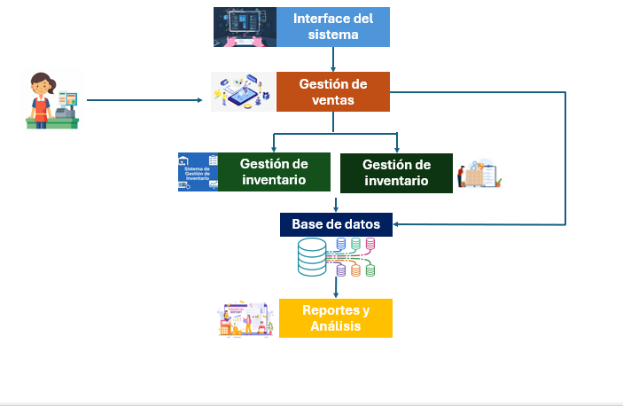

# Sistema de Gestión Cafetería "Cálida"
Este proyecto tiene como objetivo desarrollar un sistema de gestión de inventarios y ventas para la cafetería "Cálida", ubicada en Juárez, Nuevo León.
## Diagrama del sistema

## Funcionalidades
- Control de inventario
- Registro de ventas
- Generación de reportes

## Tecnologías
- Java / (o lo que usarás después)
- MySQL

## Autor
Dana Urbina
